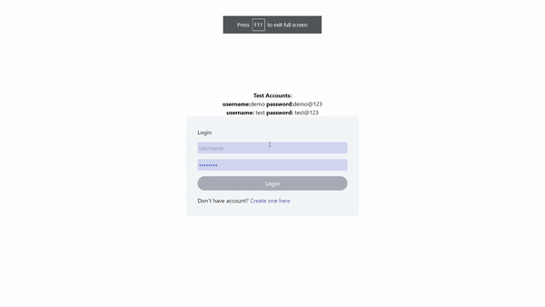

## Demo



## How to run the app locally?

```
$ git clone https://github.com/suhaasya/banker.git
$ cd banker
$ npm install
$ npm run dev
```

## Screens in this project

- Authentication Page
  - signup
  - login
- Home Page
  - home

## Features

- Home Page with options of Transfer Money, Request Loan and Delete Account

## Tech Stack and Tools

- React with Typescript
- React Router v6
- Redux with Redux-Toolkit
- Git For Version Control
- vercel for Deployment

## Live Link

[Banker](http://banker-sigma.vercel.app/)
